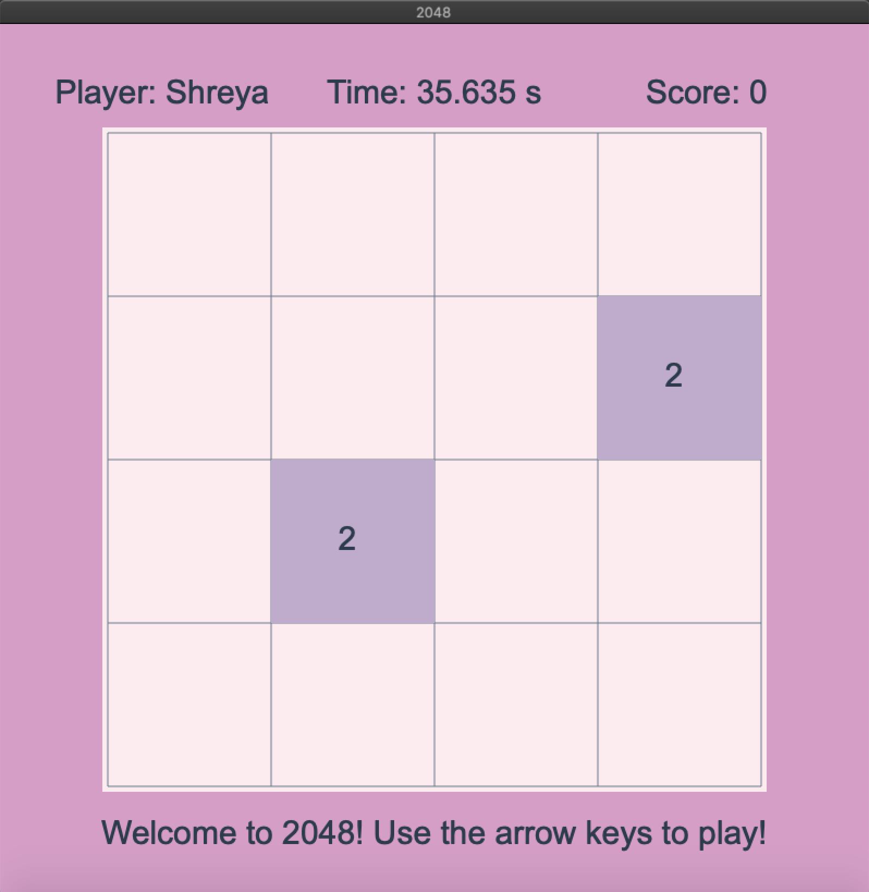
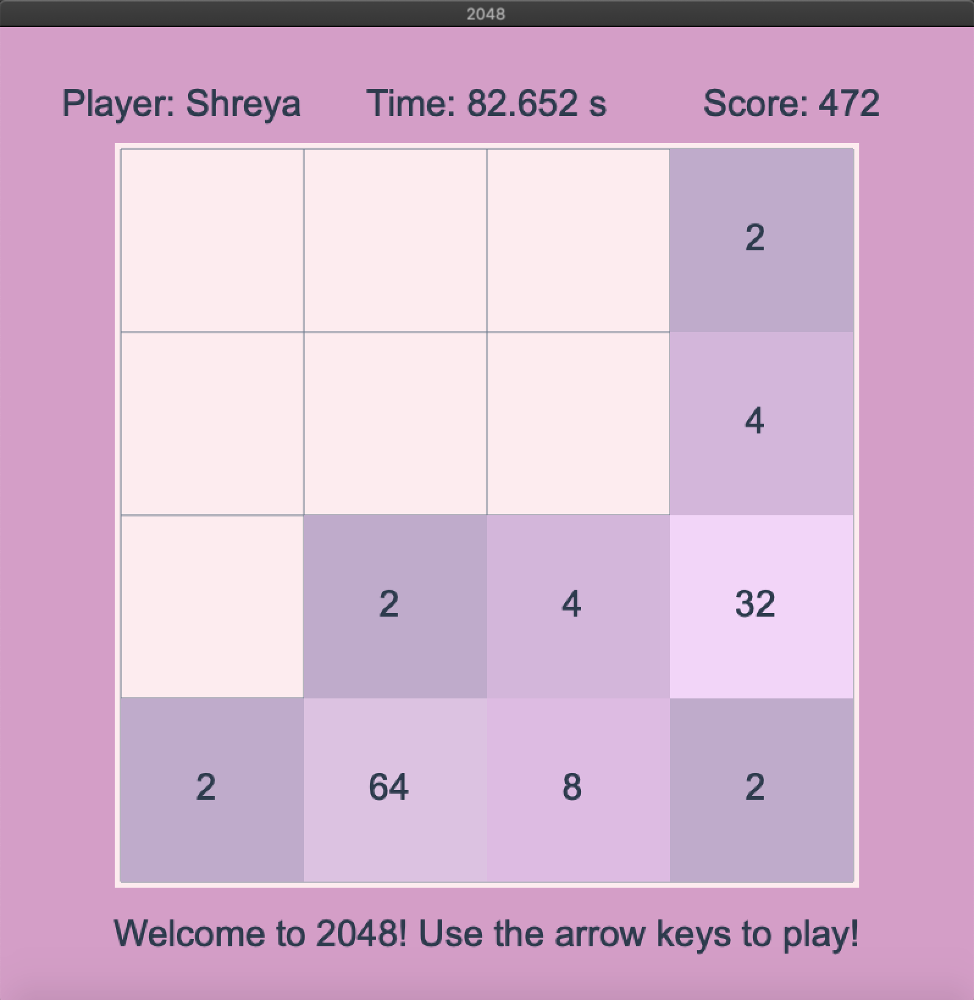
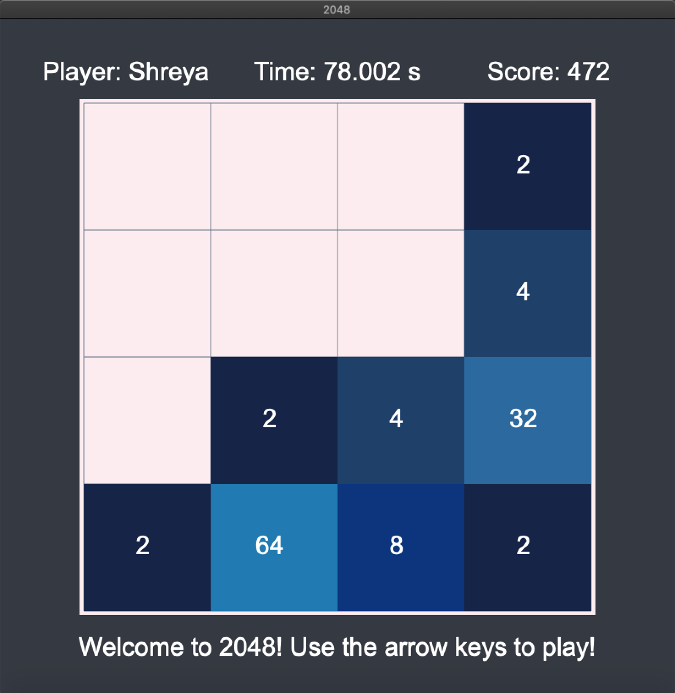

# 2048

Read [this document](https://cliutils.gitlab.io/modern-cmake/chapters/basics/structure.html) to understand the project
layout.

**Author**: Shreya Sharma - [`ssharm90@illinois.edu`](mailto:ssharm90@illinois.edu)

#### The classic 2048 game recreated as a cinder app

Light Theme

Dark theme

## How to run the game
##### Instructions for downloading are linked in the title, must add libraries and dependencies to CMake files
### Dependencies needed:
1. [CLion](https://www.jetbrains.com/clion/) - The IDE used to run the game
2. [Cinder Framework](http://libcinder.org/) - Graphics library
3. [Catch2](https://github.com/catchorg/Catch2) - Testing framework for the game
### External Libraries needed: 
1. [gflags](https://gflags.github.io/gflags/) - Used to input the player's name in order to add it to the database
2. [sqlite3](https://www.sqlite.org/capi3ref.html) - Used to add player name and score to database
3. [sqlite-modern-cpp](https://github.com/SqliteModernCpp/sqlite_modern_cpp) - Wrapper library that makes SQL easy to use
### Get started
    Download Cinder (v0.9.2) for your MacOS or Windows. 
    Extract the downloaded item into a folder called ~/Cinder
    Open the ~/Cinder folder in CLion and build libcinder.
    Create a directory called my-projects in ~/Cinder. Clone this repository into this new folder.
    Open the 2048 project in CLion, set the target to cinder-myapp and click the run button.
## Game
### How to play
The goal is to reach the 2048 tile by combining like tiles. Each turn, a new block with the value 2 appears in a random space. 
When you combine tiles by shifting the board in any direction, blocks with the same value merge and double in value. 
Don't let the board fill up. Your score increases by the value of each combined tile during each move. 
### About
This game was originally created by a 19 year old named Gabriele Cirulli in 2014 and has been expanded to several 
different platforms since then due to its extreme popularity.

[Further Reading](https://en.wikipedia.org/wiki/2048_(video_game))

### Controls
#### Play
Key|Action
---|------
<kbd>Up</kbd>|Slide the board upwards
<kbd>Down</kbd>|Slide the board downwards
<kbd>Left</kbd>|Slide the board to the left
<kbd>Right</kbd>|Slide the board to the right

#### Other
Key|Action
---|------
<kbd>m</kbd>|Toggle between light and dark mode
<kbd>q</kbd>|Forfeit the current game
    
## Original Project Proposal
Can be found [here](https://github.com/CS126SP20/project-proposal-ssharm90#2048).
